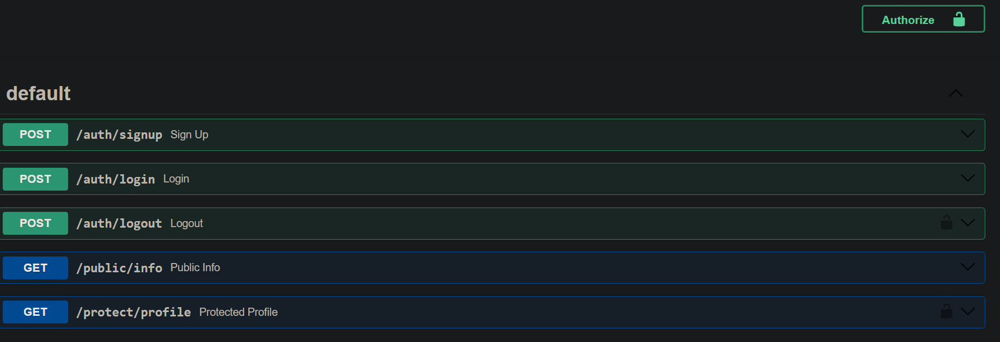

# BE-03 — FastAPI + Supabase Authentication

A minimal FastAPI backend demonstrating a production-style authentication flow: **Supabase Auth handles credentials** (signup, login, session issuance) while the application **validates JWTs server-side** and gates protected routes.

Built as a learning project for JWT security mechanics — token structure, server-side validation, session revocation, and protected-route patterns.

## Features

- 🔐 **Supabase Auth** for signup / login / logout — password hashing and token minting handled by Supabase
- 🛡️ **Server-side JWT validation** via Supabase's `/auth/v1/user` endpoint — catches revoked sessions that local decoding cannot
- 🚪 **Protected routes** with a reusable `Depends(get_user)` dependency
- 📖 **Auto-generated Swagger UI** at `/docs`

## Tech Stack

| Layer     | Technology                          |
| --------- | ----------------------------------- |
| API       | FastAPI (Python 3.13)               |
| Auth      | Supabase Auth (GoTrue)              |
| Database  | Supabase Postgres (via SQLAlchemy)  |
| Tooling   | uv (package & env management)       |

## Project Structure

```
BE-03/
├── main.py              # FastAPI app, mounts routers, DB connectivity check
├── database.py          # Supabase client singleton + get_supabase dependency
├── dependency.py        # security scheme, JWKS client, get_user dependency
├── routers/
│   ├── auth.py          # /auth/signup, /auth/login, /auth/logout
│   ├── protected.py     # /protect/profile (requires auth)
│   ├── pub.py           # /public/info (public)
│   └── health.py        # / (service info)
├── pyproject.toml       # Dependencies (managed by uv)
├── .env.example         # Environment template
└── Swagger_UI.png       # API documentation screenshot
```

---

## Quick Start — 5-Minute Checkpoint

> A peer can clone this repo, plug in their own Supabase values, and run the
> authenticated API in under five minutes.

### 1. Prerequisites

- [Python 3.13+](https://www.python.org/)
- [uv](https://docs.astral.sh/uv/) (`pip install uv` or the official installer)
- A [Supabase](https://supabase.com) project (free tier works)

### 2. Clone & install

```bash
git clone <your-repo-url>
cd BE-03
uv sync
```

### 3. Configure environment variables

```bash
cp .env.example .env
```

Then fill in the values. Every value comes from your Supabase dashboard:

| Variable          | Value                                                        | Where to find it in Supabase |
| ----------------- | ------------------------------------------------------------ | ---------------------------- |
| `user`            | `postgres.<project-ref>`                                     | Settings → Database → **Connection string** → *Transaction pooler* (use the username shown) |
| `password`        | Your database password                                       | Shown in the same Connection string dialog |
| `host`            | `aws-0-<region>.pooler.supabase.com`                         | Same dialog (Transaction pooler) |
| `port`            | `6543`                                                       | Same dialog (Transaction pooler) |
| `dbname`          | `postgres`                                                   | Same dialog |
| `SUPABASE_URL`    | `https://<project-ref>.supabase.co`                          | Settings → **API** → Project URL (no `/rest/v1/` suffix) |
| `SUPABASE_KEY`    | Your **anon public** key                                     | Settings → **API** → API keys |

**Important:** use the **Transaction pooler** connection (port `6543`), not the direct
connection — direct connections are IPv6-only and will fail on most networks.

### 4. One dashboard toggle (dev convenience)

Supabase sends a confirmation email on signup by default. For local development, turn
it off so signup returns a session immediately:

```
Authentication → Providers → Email → toggle OFF "Confirm email"
```

### 5. Run

```bash
uv run uvicorn main:app --reload
```

You should see `Server running and connected to Supabase`, then:

- API: <http://localhost:8000>
- Swagger UI: <http://localhost:8000/docs>

---

## API Reference

| Method | Path                | Auth Required | Description                                             | Request Body                        |
| ------ | ------------------- | ------------- | ------------------------------------------------------- | ----------------------------------- |
| GET    | `/`                 | ❌ No         | Service name, version, available endpoints              | —                                   |
| GET    | `/public/info`      | ❌ No         | Public endpoint — no authentication needed              | —                                   |
| POST   | `/auth/signup`      | ❌ No         | Create a new account                                    | `{"email": "...", "password": "..."}` |
| POST   | `/auth/login`       | ❌ No         | Exchange credentials for `access_token` + `refresh_token` | `{"email": "...", "password": "..."}` |
| POST   | `/auth/logout`      | ✅ Bearer     | Revoke the current session                              | —                                   |
| GET    | `/protect/profile`  | ✅ Bearer     | Returns the full authenticated user object              | —                                   |

Notes:

- Passwords must be **at least 6 characters** (Supabase's minimum).
- Auth'd endpoints expect the header: `Authorization: Bearer <access_token>`.
- Missing token → `401 {"detail": "Access token required"}`.
- Invalid/expired/revoked token → `401 {"detail": "Invalid authentication credentials or expired token."}`.

### Authentication Flow

```
signup  → POST /auth/signup        → Supabase stores the credentials
login   → POST /auth/login         → Supabase verifies, returns JWT (ES256)
request → GET /protect/profile     → Authorization: Bearer <token>
                                     dependency.py validates server-side,
                                     revoked/expired tokens → 401
```

The JWT carries `sub` (user UUID), `aud: "authenticated"`, and `exp`. Validation is
performed **server-side** through Supabase's `/auth/v1/user` endpoint, which also
rejects tokens from revoked sessions (e.g. after logout) — something local decoding
cannot detect.

## Swagger UI



## Verifying the Checkpoint

With the server running:

```bash
# 1. Health check
curl http://localhost:8000/

# 2. Sign up
curl -X POST http://localhost:8000/auth/signup \
  -H "Content-Type: application/json" \
  -d '{"email":"you@example.com","password":"secret123"}'

# 3. Log in (capture the access_token from the response)
curl -X POST http://localhost:8000/auth/login \
  -H "Content-Type: application/json" \
  -d '{"email":"you@example.com","password":"secret123"}'

# 4. Access a protected route
curl http://localhost:8000/protect/profile \
  -H "Authorization: Bearer <access_token>"

# 5. Log out, then the same token is rejected
curl -X POST http://localhost:8000/auth/logout \
  -H "Authorization: Bearer <access_token>"
curl http://localhost:8000/protect/profile \
  -H "Authorization: Bearer <access_token>"   # → 401
```

---

## Troubleshooting

| Problem | Cause / Fix |
| ------- | ----------- |
| `could not translate host name "db.<ref>.supabase.co"` | Old/decommissioned hostname — use the pooler host (`aws-0-<region>.pooler.supabase.com:6543`) |
| `Invalid path specified in request URL` | `SUPABASE_URL` contains `/rest/v1/` — it must be the base URL only |
| `Email rate limit exceeded` | Supabase's hourly email quota — wait for the hour to reset, or turn off "Confirm email" |
| `Email not confirmed` on login | "Confirm email" is still ON — toggle it off in the dashboard |
| Emoji/crash when running `fastapi dev` on Windows | Console encoding — use `uv run uvicorn main:app --reload`, or set `PYTHONUTF8=1` |
| Changes to `.env` not picked up | Env vars load at import time — restart the server |
| `422` on a protected route | Missing `Authorization` header entirely — send `Authorization: Bearer <token>` |

---

## License

Educational project. No license specified.
